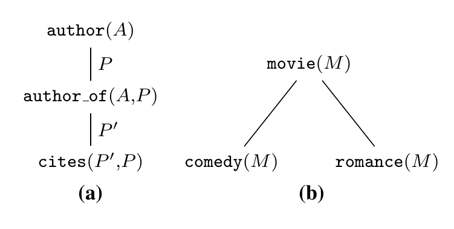

## Counts-of-counts similarity for prediction and search in relational data

In the paper Jaeger et. Al presents a new metric that can be utilized to compare the similarity between graph entities which in turn can be utilize for searching and prediction on relational data.

The metric is called counts-of-counts and works by taking a Type Extension Tree (TET) which is used to describe the counts-of-counts features which describe the overall graph structure. An example of a TET can be seen below:

The definition of a TET can be seen below:

*A type extension tree (TET) is a rooted tree whose nodes are labeled with atoms, and whose edges can be labeled with variables.*

The idea behind it is that  A TET feature defines which relations to follow for assembling the relevant neighborhood, and what attributes of neighboring nodes to consider.

