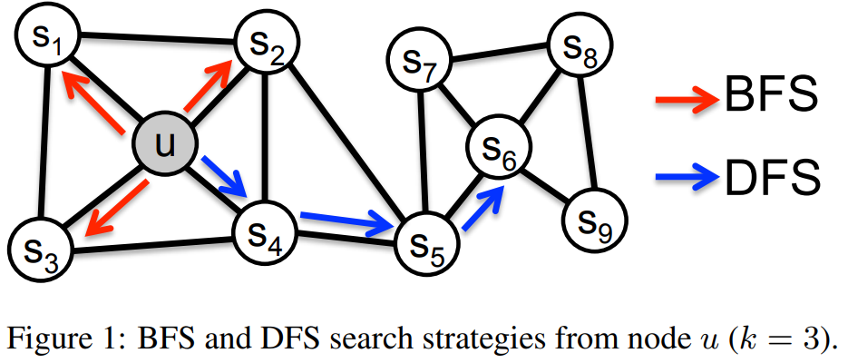
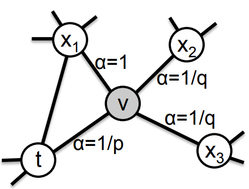

# Node2vec - Scalable Feature learning for Networks

In this paper Grover and Leskovec presents an algorithm for efficient feature learning for nodes in networks. This is done by mapping nodes to a lower dimensional space of their features, that try to preserve local networks of neighborhood nodes and communities, using a random walk approach to generate a nodes neighborhood network. They formulate a random walk strategy that interpolates between BFS and DFS to try and preserve both homophily and structural equivalence.

First a feature learning framework which extends the skip-gram model is made. Feature learning is formulated as a maximum likelihood optimization problem. Let $G = (V,E)$ be a given network and let $f : V \to \R^d$ be the mapping function from nodes to their feature representation, $d$ is the parameter specifying the number of dimensions, for the feature representation of a node. For every source node $u \in V$, we define $Ns(u) \subset V$ as a network neighborhood of a node $u$, generated through a sampling strategy $S$.

The skip-gram architecture is extended to networks, by optimizing the objective function, which maximizes the log-probability of observing a network neighborhood $Ns(u)$ for a node $u$, conditioned on its feature representation given by $f$:

(Equation 1)
$$
\max_{f}  \sum_{u\in{V}} log Pr(Ns(u)|f(u))
$$

They then simplify the objective function in (Equation 1) to the following equation:

(Equation 2)
$$
\max_{f} \sum_{u\in{V}} [-log Z_u + \sum_{n_i\in{Ns(u)}} f(n_i) \times f(u) ]
$$

where $Z_u = \sum_u\in{V} exp(f(u)\times f(v))$ is approximated using negative sampling. The equation is then optimized using sotchastic gradient ascent over the model parameters defining the features $f$.

The skip-gram architecture was originally developed within the context of natural languages, text have a linear nature, whereas networks are not linear and thus a rich notion of a neighborhood is needed. They propose a randomized procedure, which samples many different neighborhoods for a given source node u. A neighborhood $Ns(u)$ is also not restricted to just the immediate neighbors but can have different structures depending on the sampling strategy $S$ that is used.

Thus given a graph and a source node, they want to sample its neighborhood $Ns(u)$. To be able to compare the different sampling strategies $S$, the size of the neighborhood set $Ns(u)$ is constrained to $k$ nodes and will sample multiple neighborhood sets for a single node $u$ using a sampling strategy $S$.

## Sampling strategies

There are in general two extreme sampling strategies for generating neighborhood sets $Ns(u)$ of $k$ nodes.

A Breadth-first sampling (BFS), where a nodes neighborhood is restricted to nodes which are immediate neighbors to the node, finding the immediate community that the node is part of. This gives us a microscopic view of the neighborhood and is therefor good for finding structural equivalence.

A Depth-first sampling (DFS), where a nodes neighborhood consist of nodes sampled at an increasing distance from the node, giving a bigger view of the structure and differences. This gives us a macro-view of the neighborhood, which is essential for inferring communities based on homophily.

In real life networks commonly exhibit both behaviors, where some nodes exhibit homophily while others reflect structural equivalence, thus a sampling strategy that can find both is needed.

Shows DFS and BFS strategy with k = 3

## Node2vec

Given the observations above, a sampling strategy $S$ is then formulated which allows interpolation between a BFS and DFS approach. This is done by developing a biased random walk procedure which can explore a neighborhood in a BFS as well as a DFS approach.

Given a source node $u$, simulate a random walk of length $l$. Let $c_i$ be the i'th node in the walk, starting with $c_o = u$. Nodes $c_i$ are then generated by the distribution given in (EQ 3):

(Equation 3)
$$
P(c_i = x | c_{i-1} = v) =

\begin{cases}
\frac{\pi_{vx}}{Z}  \; \text{if} \: (v,x) \in E\\
0 \; \text{otherwise}
\end{cases}
$$

where $\pi_{vx}$ is the unnormalized transition probability between node $v$ and $x$, and $Z$ is the normalizing constant.

### Search bias α

shows the random walk procedure in node2vec.

A 2nd order random walk is defined, with two parameters $p$ and $q$, which helps guide the walk.

Looking at the figure above consider a random walk that have just traversed the edge $(t, v)$ and now resides at node $v$. The walk then have to decide on the next step to take and evaluates the transition probabilities $\pi_{vx}$ on edges $(v,x)$ leading from node $v$. The unnormalized transition probability is set to $\pi_{vc} = \alpha_pq (t,x) \times w_{vx}$ where:

(Equation 4)
$$
\alpha_{pq} (t,x) = 

\begin{cases} 
\frac{1}{p} \; \text{if} \:  d_{tx} = 0\\
1 \; \text{if} \: d_{tx} = 1\\
\frac{1}{q} \; \text{if} \: d_{tx} = 0
\end{cases}
$$

Here $d_tx$ denotes the shortest path distance between nodes $t$ and $x$. In this case $p$ and $q$ controls how fast the walker explores and leaves the neighborhood of a starting node $u$ and allows the search procedure to interpolate between BFS and DFS.

### Search Parameters

$p$ is the return parameter, and controls the likelihood of immediately revisiting a node in the walk, a high value ensures that you are less likely to sample an already visited node, encouraging exploration, whereas a low value will keep the walker close to a starting node $u$.

$q$ is the In-out parameter, and allows the search to differintiate between inward and outward nodes. A high value will keep the walker more biased towards a starting node $u$, obtaining a local view. Whereas a low value will make the walker more inclined to visit nodes further away from $u$, encouraging outward exploration.

Using the node2vec strategy, transition probabilities for a network is calculated for each node depending on $p$ and $q$. A random walker than traverses the tree sampling a chosen amount of neighborhood $Ns(u)$. The walks are then fed to gensim which learns a model and embeds the walks into a feature vector of $d$ dimensions.

